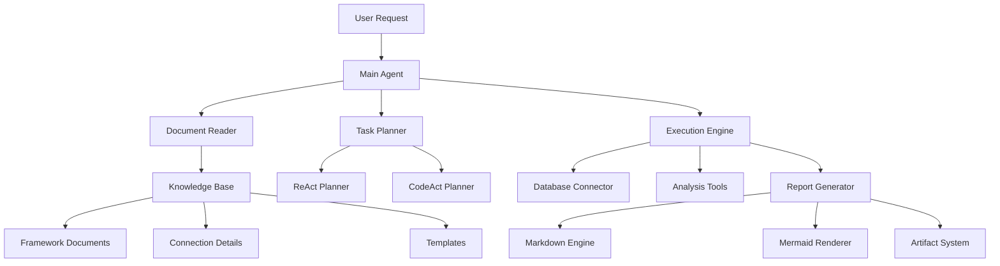

# Comprehensive Research Report: Document-Driven Agentic AI Systems

**Date**: January 2025  
**Project**: Knowledge-Base Controlled Agent System  
**Research Scope**: Technical foundations for building enterprise-grade document-driven AI agents

---

## Executive Summary

Based on extensive research into current agentic AI trends, architectural patterns, and existing solutions, we've identified key insights for building a robust document-driven agent system. The market is rapidly moving toward **"AI-native"** architectures where intelligence is embedded at the foundation level, rather than retrofitted onto traditional systems. Our research reveals that successful enterprise deployments emphasize **evaluation infrastructure, modular design, and human oversight** as critical success factors.

**Key Findings**:
- Agentic AI market projected to reach $10.41 billion in 2025 (56.1% CAGR)
- 82% of organizations plan AI agent integration by 2026
- CodeAct patterns show 20% higher success rates than traditional ReAct for complex tasks
- Most agent failures stem from inadequate evaluation infrastructure, not model limitations
- Document-driven control systems are emerging as the preferred approach for enterprise deployments

---

## 1. Agentic AI Current Trends & Market Analysis

### Market Growth & Adoption Trajectory

The agentic AI landscape is experiencing unprecedented growth, with industry leaders from Gartner to McKinsey identifying it as the dominant trend for 2025. **Key market indicators**:

- Global agentic AI tools market: **$10.41 billion in 2025** (56.1% CAGR)
- **25% of GenAI companies** will launch agentic AI pilots in 2025
- **50% adoption rate** projected by 2027
- Enterprise funding for GenAI native applications reached **$8.5B** through October 2024

### Defining Characteristics of Modern Agentic AI

Modern agentic AI systems are characterized by **autonomous planning, reasoning, and adaptation capabilities**:

> *"The true definition [of an AI agent] is an intelligent entity with reasoning and planning capabilities that can autonomously take action. Unlike traditional AI that responds to prompts, agentic AI systems can plan, execute, and adapt autonomously."*

**Core Capabilities**:
1. **Autonomous Planning**: Ability to break down complex tasks into executable steps
2. **Dynamic Reasoning**: Context-aware decision making with tool selection
3. **Adaptive Execution**: Real-time adjustment based on feedback and outcomes
4. **Multi-Agent Collaboration**: Coordinated work between specialized agents

### Critical Trends for 2025

#### 1. Multi-Agent Collaboration Systems
- **True multiagent systems** launching in late 2024/early 2025
- Network-orchestrated autonomous agents outperforming single-model systems
- **40-60% improvement** in operational efficiency reported

#### 2. Real-Time Decision Making at Scale
- **90% reduction** in response times compared to human operators
- **40% improvement** in decision accuracy
- Autonomous process optimization becoming standard

#### 3. Enterprise Customer Service Transformation
- **80% autonomous resolution** of common issues predicted by 2029
- **30% reduction** in operational costs
- Shift from reactive to proactive service models

### Reality Check: Enterprise Readiness

Despite optimistic projections, **enterprise deployment faces significant challenges**:

- **Reliability requirements**: "Getting the job right most of the time isn't enough"
- **Infrastructure gaps**: 86% of enterprises need system upgrades for AI agents
- **Cost complexity**: Variable cost models creating budget uncertainty
- **Compliance challenges**: Dynamic behavior complicates certification processes

---

## 2. Traditional vs AI-Native Software Architecture

### Fundamental Architectural Differences

The research reveals a **paradigm shift** from traditional software patterns to AI-native architectures, based on the Russian VC.ru analysis and additional sources:

| Aspect | Traditional Software | AI-Native Software |
|--------|---------------------|-------------------|
| **Business Logic** | Hardcoded, requires deep technical knowledge | Delegated to LLMs, potentially beyond developer comprehension |
| **Extensibility** | New features require code branches | Features added via model updates, RAG sources, tool connections |
| **Output** | Fixed, predetermined formats | Flexible, dynamically changing, interactive |
| **Workflow** | Rigid, code-defined sequences | Dynamically generated workflows |
| **Trust Model** | Predictable decision-making | Opaque decisions requiring UX explanation |
| **Data Role** | Static input | Dynamic element influencing business logic |
| **Cost Structure** | Primarily fixed costs | Variable costs with "credits" models |
| **Compliance** | Easier to certify | Challenging due to dynamic nature |

### AI-Native Architecture Principles

**Intelligence as Foundation**: 
> *"AI-native architecture makes the intelligence inseparable from the core function. Traditional software with AI features asks 'How can we make this existing thing smarter?' AI-native systems ask 'What would we build if intelligence was free and infinite?'"*

**Key Architectural Characteristics**:
1. **Distributed Intelligence**: Components designed to enable intelligence across the system
2. **Adaptive Optimization**: Systems that improve performance over time
3. **Federated Learning**: Models learning and executing in distributed networks
4. **Real-time Processing**: AI-native data pipelines processing information instantly

### Migration Challenges & Strategies

**The Migration Paradox**:
> *"You can't gradually add intelligence to existing systems and expect AI-native results. But you also can't throw away working systems and start over. Most organizations end up running parallel architectures during transition periods, which doubles complexity before it reduces it."*

**Successful Migration Approaches**:
- **AI-driven migration tools** reducing manual effort by 40%
- **Replatforming** as the most common strategy ("lift, tinker, and shift")
- **Parallel architecture** periods for risk mitigation
- **Infrastructure-first** approach with 86% of enterprises requiring upgrades

---

## 3. CodeAct vs ReAct Framework Analysis

### ReAct (Reasoning and Acting) Framework

ReAct represents the foundational pattern for agentic AI, combining **chain-of-thought reasoning with external tool use**:

**Core Workflow**: `Thought → Action → Observation` (repeated until completion)

**Strengths**:
- Flexible reasoning with tool integration
- Transparent thought processes
- Robust for general problem-solving
- Well-established pattern with broad framework support

**Limitations**:
- Can hallucinate answers during reasoning
- Limited by pre-defined action spaces
- Less effective for computational tasks

### CodeAct Framework Evolution

CodeAct represents an **evolution of ReAct**, using **executable Python code as the unified action space**:

**Key Innovation**: Instead of JSON-based tool calls, agents write and execute Python code, observing results and iterating.

**Performance Advantages**:
- **Up to 20% higher success rate** compared to traditional alternatives
- Unified action space through executable code
- Dynamic revision of actions based on execution results
- Better handling of complex, multi-step computational tasks

**Use Case Optimization**:
- **ReAct**: Flexible reasoning with tool use, exploratory tasks
- **CodeAct**: Computational tasks, automation workflows, precise verification needs

### LangGraph Implementation Support

LangGraph provides **prebuilt components** for both patterns:

**ReAct Implementation**:
- `create_react_agent(model, tools)` for quick scaffolding
- Template-based approach with flexible extension
- Supervisor patterns for multi-agent coordination

**CodeAct Implementation**:
- Recently introduced `create_codeact` constructor
- Python interpreter integration
- Turing-complete programming language leverage

**Multi-Agent Architecture Patterns**:
1. **Supervisor Pattern**: Central coordinator with specialized workers
2. **Hierarchical Systems**: Teams of agents with individual supervisors
3. **Agent Handoffs**: Elegant control transfer mechanisms
4. **Dynamic vs Explicit Control Flow**: LLM-driven vs predefined routing

---

## 4. Multi-Agent Framework Comparison

### Framework Landscape Analysis

**Top Frameworks for 2025**:

| Framework | Strengths | Best Use Cases | Complexity |
|-----------|-----------|----------------|------------|
| **LangGraph** | Graph-based workflows, debugging tools, enterprise features | Complex workflows, state management | Medium-High |
| **CrewAI** | Role-based agents, business workflows | Team collaboration, structured processes | Medium |
| **AutoGen** | Conversational agents, Microsoft ecosystem | Multi-party conversations, research tasks | Medium |
| **OpenAI Swarm** | Lightweight, OpenAI native | Simple coordination, experimental | Low |

### LangGraph Advantages for Our Use Case

**Why LangGraph Emerges as Optimal Choice**:

1. **State Management**: Robust handling of complex conversation and task states
2. **Conditional Routing**: Both explicit and dynamic control flow support
3. **Enterprise Features**: Built-in monitoring, debugging, and observability
4. **Framework Maturity**: Production-ready with extensive documentation
5. **Multi-Pattern Support**: Native ReAct and CodeAct implementations
6. **Visual Development**: LangGraph Studio for development and debugging

**Architecture Flexibility**:
- Single agent to complex multi-agent systems
- Hierarchical, sequential, and parallel execution patterns
- Human-in-the-loop integration points
- Persistent state across sessions

---

## 5. Claude Artifacts Architecture Analysis

### Core Architecture Components

Claude Artifacts provides a **sandboxed execution environment** for generated content with the following architecture:

**Security Model**:
- **Iframe sandboxing** for user protection
- **Strict Content Security Policies (CSPs)** limiting network access
- **Message passing system** for cross-origin communication
- **Automatic security checks** ensuring proper execution context

**Supported Content Types**:
- Code with syntax highlighting
- **Markdown documents** (our primary interest)
- HTML content and complete webpages
- SVG images and **Mermaid diagrams**
- React components with interactivity

### Markdown Rendering System

**Technical Implementation**:
- **Automatic artifact creation** for substantial content (>15 lines)
- **Live rendering** with mathematical expression support (Marked + KaTeX)
- **Interactive editing** and iteration capabilities
- **Self-contained outputs** in dedicated windows

**Rendering Capabilities**:
- Plain text and formatted markdown
- **Embedded mathematical expressions**
- **Mermaid diagram integration**
- **Live preview** with real-time updates

### Application to Our System

**Key Insights for Report Generation**:
1. **Sandboxed rendering** ensures security for generated content
2. **Markdown-first approach** aligns with our requirements
3. **Mermaid integration** provides visualization capabilities
4. **Live editing** enables iterative improvement
5. **Artifact pattern** separates generated content from conversation

---

## 6. Existing Enterprise Solutions Analysis

### Document-Driven Agent Systems in Production

**Market Leaders and Approaches**:

#### Enterprise Platforms
1. **PwC's Agent OS**: Enterprise AI command center connecting intelligent agents
2. **SigOS**: Unified operating system for enterprise AI agents with permission-based access
3. **Moveworks Knowledge Studio**: Integration with all business applications and systems
4. **Sema4.ai**: Intelligent agents integrating with ERPs, CRMs, data platforms

#### Specialized Solutions
1. **Zendesk AI Knowledge Base**: Self-service resource creation and management
2. **Knowmax**: AI-powered knowledge management with smart search and content creation
3. **Tettra**: Documentation and collaboration with AI assistance
4. **Guru**: Centralized knowledge with proactive information delivery

### Common Implementation Patterns

**Successful Deployment Strategies**:

1. **Knowledge-as-Code**: Policies and procedures encoded in documents rather than hardcoded
2. **Federated Knowledge**: Multiple specialized knowledge bases for cross-functional tasks
3. **Continuous Learning**: Agent feedback drives process improvement
4. **Human-in-the-Loop**: Strategic oversight with automated execution

**Enterprise Benefits Realized**:
- **13.8% productivity increase** for teams using AI assistance
- **47% reduction** in information search time
- **Significant operational cost reduction** through self-service capabilities
- **Improved consistency** across organizational processes

---

## 7. Common Deployment Failures & Lessons Learned

### Primary Failure Modes

**Infrastructure and Evaluation Gaps**:
> *"80% of enterprises struggle with connecting systems, consuming 40% of IT team resources, while 86% of organizations need upgrades to support AI."*

**Common Mistakes**:
1. **Lack of Evaluation Infrastructure**: Building agents without proper testing frameworks
2. **Inadequate System Preparation**: Underestimating infrastructure requirements
3. **Poor Monitoring**: Missing observability for multi-agent interactions
4. **Cost Overruns**: Rising workloads increasing costs by 30% annually
5. **Tool Integration Failures**: Incorrect parameter passing and output interpretation

### Critical Success Factors

**Evaluation-First Approach**:
> *"Before you even start building it, you should have an eval infrastructure in place as it's the unit test for your AI agent system."*

**Best Practices Identified**:

1. **Start Simple**: Single agent with sufficient tools before multi-agent complexity
2. **Modular Architecture**: Flexibility, scalability, and maintainable systems
3. **Safety Controls**: "Big red stop button" for emergency shutdowns
4. **Default Conservative**: Compliance over speed, safety over convenience
5. **Observability First**: Comprehensive logging and monitoring from day one

**Architecture Principles**:
- **Explicit routing** instead of LLM guesswork
- **Structured outputs** with consistent formatting
- **Tight memory scoping** to prevent context leakage
- **Separate task tracking** from conversation history

### Enterprise Deployment Strategies

**Phased Rollout Approach**:
1. **Pilot Programs**: 25% of GenAI companies launching pilots in 2025
2. **Infrastructure Upgrades**: Address the 86% upgrade requirement early
3. **Multi-Agent Preparation**: Design for future complexity from the start
4. **Continuous Monitoring**: Real-time system health and performance tracking

---

## 8. Report Generation & Visualization Capabilities

### AI-Powered Report Generation Systems

**Current State of Technology**:

Modern AI agents are transforming report generation through **automated data analysis and presentation**:

- **Multi-agent collaboration** for comprehensive business reports
- **70-90% reduction** in completion time for complex documents
- **Intelligent structure analysis** with context-aware formatting
- **Automated markdown optimization** with NLP and deep learning

### Specialized Report Generation Architectures

**Multi-Agent Report System Pattern**:
1. **Data Researcher Agent**: Industry-specific data gathering and analysis
2. **News Analyst Agent**: Latest information extraction and sentiment analysis
3. **Report Writer Agent**: Synthesis into structured, actionable markdown reports

**Technical Capabilities**:
- **Multiple format support**: .txt, .html, .md, .pdf, .doc, .json, .csv
- **Automatic document sorting** and data extraction
- **Custom workflow integrations** with enterprise systems
- **Intelligent content management** with continuous curation

### Mermaid Diagram Integration

**AI-Powered Visualization**:

Modern systems provide **seamless Mermaid diagram generation**:

- **Prompt-to-diagram generation** in seconds
- **MCP server integration** for AI agent access
- **Multiple diagram types**: flowcharts, sequence, state, ER, journey maps
- **Automated chart refreshing** with new data input

**Technical Implementation**:
- **Natural Language Processing** for text-to-diagram conversion
- **Machine Learning algorithms** for intelligent component arrangement
- **API integration** through mermaid-cli for PNG rendering
- **Interactive editing** with drag-and-drop functionality

---

## 9. Strategic Recommendations for Our Project

### Recommended Technology Stack

Based on comprehensive analysis, the optimal architecture includes:

**Core Framework**: **LangGraph**
- Superior state management capabilities
- Native support for both ReAct and CodeAct patterns
- Production-ready with enterprise features
- Extensive debugging and monitoring tools

**Agent Pattern**: **Hybrid ReAct/CodeAct**
- ReAct for document interpretation and planning
- CodeAct for data analysis and computation tasks
- Dynamic pattern selection based on task requirements

**Architecture**: **AI-Native with Document-Driven Control**
- Knowledge base documents controlling agent behavior
- Modular design supporting multiple analysis frameworks
- Artifact-style report generation with sandboxed rendering

### Implementation Phases

**Phase 1: Foundation (MVP)**
1. Single-agent system with document reading capabilities
2. Basic ReAct pattern for framework interpretation
3. Simple markdown report generation
4. PostgreSQL integration for data analysis

**Phase 2: Enhancement**
1. Multi-agent coordination for complex workflows
2. CodeAct integration for computational tasks
3. Mermaid diagram generation capabilities
4. Advanced report templating system

**Phase 3: Enterprise Features**
1. Multi-framework support and extensibility
2. Comprehensive evaluation and monitoring
3. Human-in-the-loop oversight mechanisms
4. Artifact-style interactive report rendering

### Risk Mitigation Strategies

**Technical Risks**:
1. **Evaluation Infrastructure**: Implement comprehensive testing before production
2. **Cost Management**: Monitor and optimize LLM usage patterns
3. **System Integration**: Plan for infrastructure upgrades early
4. **Reliability**: Build conservative defaults with explicit routing

**Business Risks**:
1. **Scope Creep**: Maintain focus on document-driven control paradigm
2. **Over-Engineering**: Start simple, add complexity incrementally  
3. **User Adoption**: Ensure transparent agent reasoning and decision-making
4. **Compliance**: Design with audit trails and human oversight

### Competitive Advantages

**Differentiation Opportunities**:
1. **Framework-Agnostic**: Support multiple data analysis methodologies
2. **Document-Driven**: Easy customization through knowledge base updates
3. **Artifact-Style Reports**: Interactive, explorable output format
4. **Domain Flexibility**: Adaptable to various analytical domains beyond data quality

---

## 10. Technical Architecture Recommendations

### System Architecture

### Data Flow Design

**Document-Driven Control Flow**:
1. **Request Processing**: Parse user task and role requirements
2. **Knowledge Discovery**: Read TOC and identify relevant frameworks
3. **Framework Interpretation**: Extract methodology steps and requirements
4. **Task Decomposition**: Break complex tasks into executable subtasks
5. **Execution Orchestration**: Coordinate data analysis and report generation
6. **Report Assembly**: Compile results into comprehensive markdown artifacts

### Database Integration Strategy

**Connection Management**:
- Secure credential handling through environment variables
- Connection pooling for performance optimization
- Multiple database engine support (PostgreSQL, SQL Server, etc.)
- Query template system for framework-driven analysis

**Data Analysis Pipeline**:
- Schema introspection and documentation
- Automated data profiling with statistical analysis
- Rule-based data quality assessment
- Results aggregation and summary generation

---

## Conclusion

Our research reveals that **document-driven agentic AI systems represent the future of enterprise automation**, with the market rapidly adopting AI-native architectures that embed intelligence at the foundation level. The combination of **LangGraph's robust framework capabilities**, **hybrid ReAct/CodeAct patterns**, and **artifact-style report generation** provides an optimal foundation for building a sophisticated yet maintainable system.

**Key Success Factors**:
1. **Start with strong evaluation infrastructure** before building complexity
2. **Embrace AI-native architecture patterns** rather than retrofitting traditional systems  
3. **Use document-driven control** for flexibility and maintainability
4. **Implement comprehensive monitoring** and human oversight mechanisms
5. **Design for enterprise scalability** from the beginning

The research indicates that organizations successfully deploying agentic AI systems are those that **balance automation with control**, **prioritize reliability over complexity**, and **build with future multi-agent collaboration in mind**. Our proposed architecture aligns with these best practices while providing a clear path for incremental enhancement and enterprise adoption.

---

**Research Completed**: January 2025  
**Next Phase**: Technical Implementation Planning